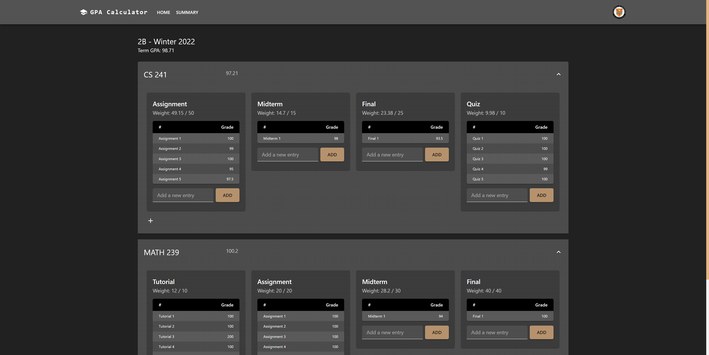

### A full-stack web application that allows students to track grades of university courses


### File Structure

```
client
│   package.json
│   tsconfig.json
│
└───public
│       index.html
│
└───src
    │   index.tsx
    │   App.tsx
    │
    └───components
    │       MUI
    │       Block.tsx
    │       BlockForm.tsx
    │       Course.tsx
    │       EntryTable.tsx
    │       Home.tsx
    │       Login.tsx
    │       ProtectedRoutes.tsx
    │       Register.tsx
    │       Term.tsx
    │       types.ts
    │       Views.tsx
    │
    └───contexts
    │       UserContext.tsx
    │
    └───controllers
    │       authController.ts
    │       blockController.ts
    │       courseController.ts
    │       termController.ts
    │
    └───reducers
            blocks.ts
            courses.ts
            terms.ts
```

```
server
│   package.json
│   index.js
│
└───routes
│   │   BlockRoute.ts
│   │   CourseRoute.ts
│   │   TermRoute.ts
│   │
│   └───Auth
│           Authentication.js
│           JWT.js
│
└───sql
        block.sql
        course.sql
        term.sql
        upd_block.sql
        user.sql
```
